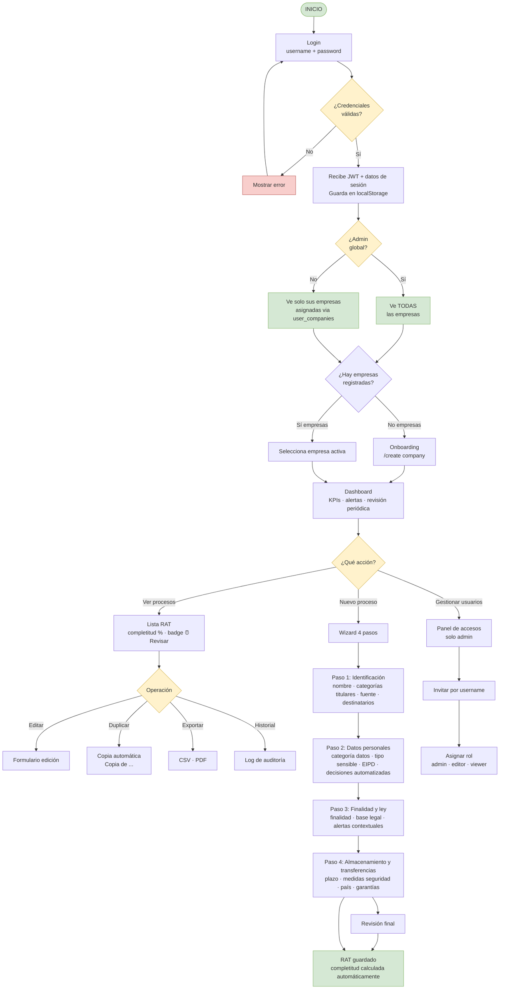
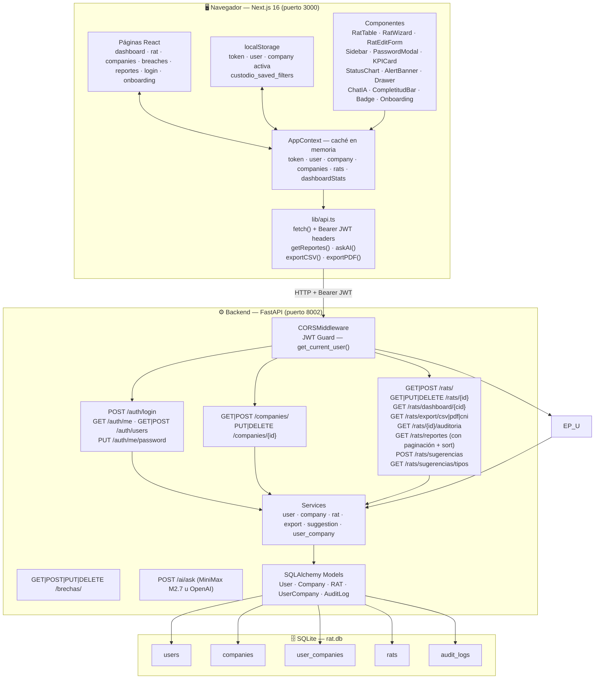
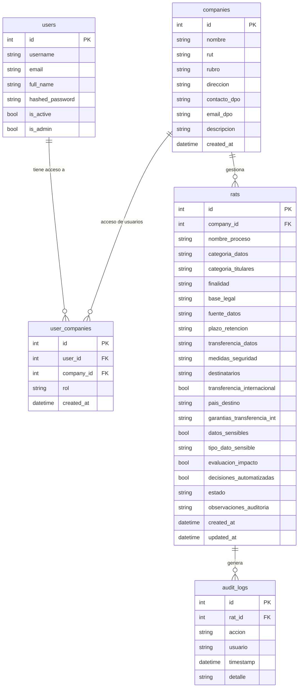
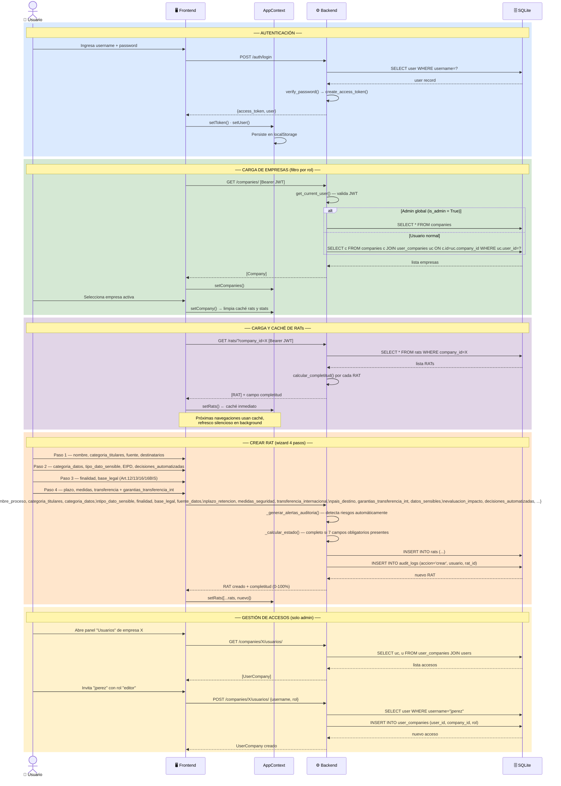

# Custodio RAT Manager — Flujo de Datos

> Generado: 2026-04-24 · Actualizado: 2026-05-12 (Módulo Onboarding, validación de sesión con /auth/me, redirect 401 automático)  
> Stack: FastAPI + SQLAlchemy + SQLite · Next.js 16 + TypeScript + Tailwind v4

---

## 1. Flujo de Usuario

---

## 2. Arquitectura Técnica

---

## 3. Modelo de Datos

---

## 4. Flujo de Datos Completo

