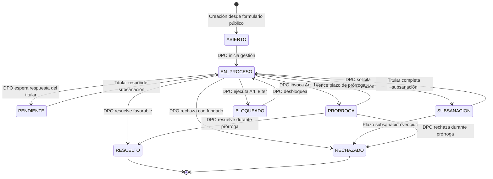
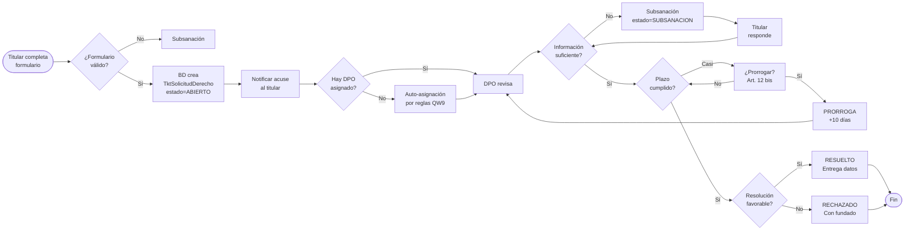
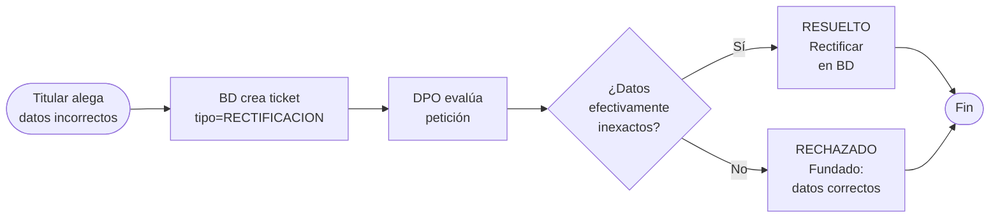
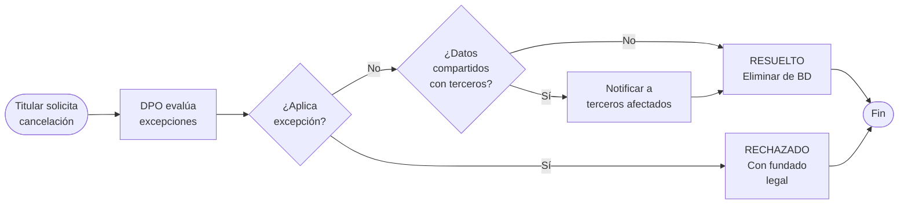
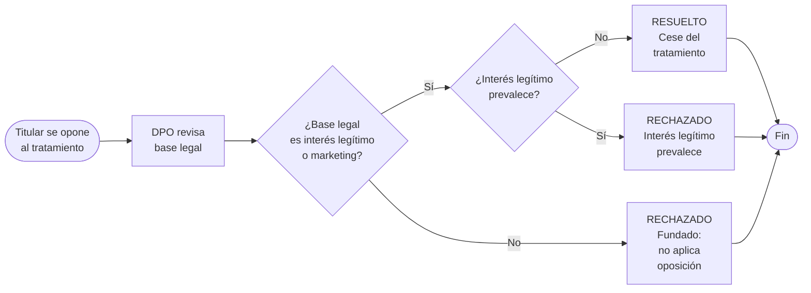
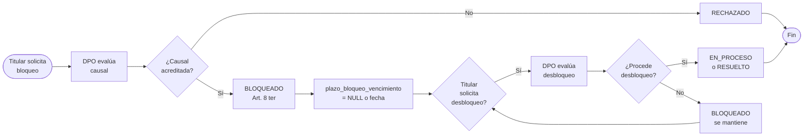
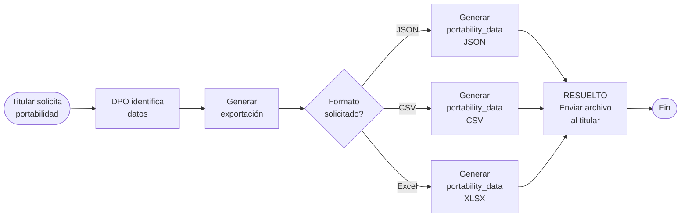
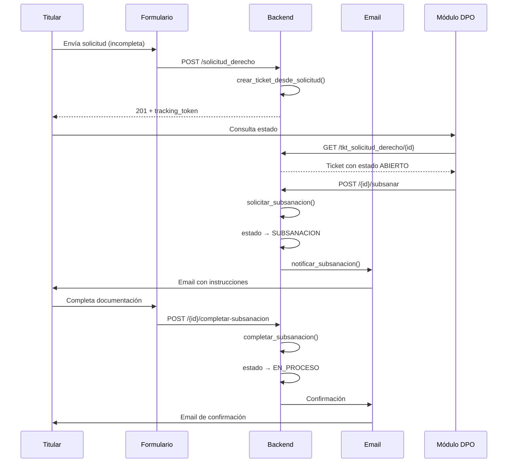
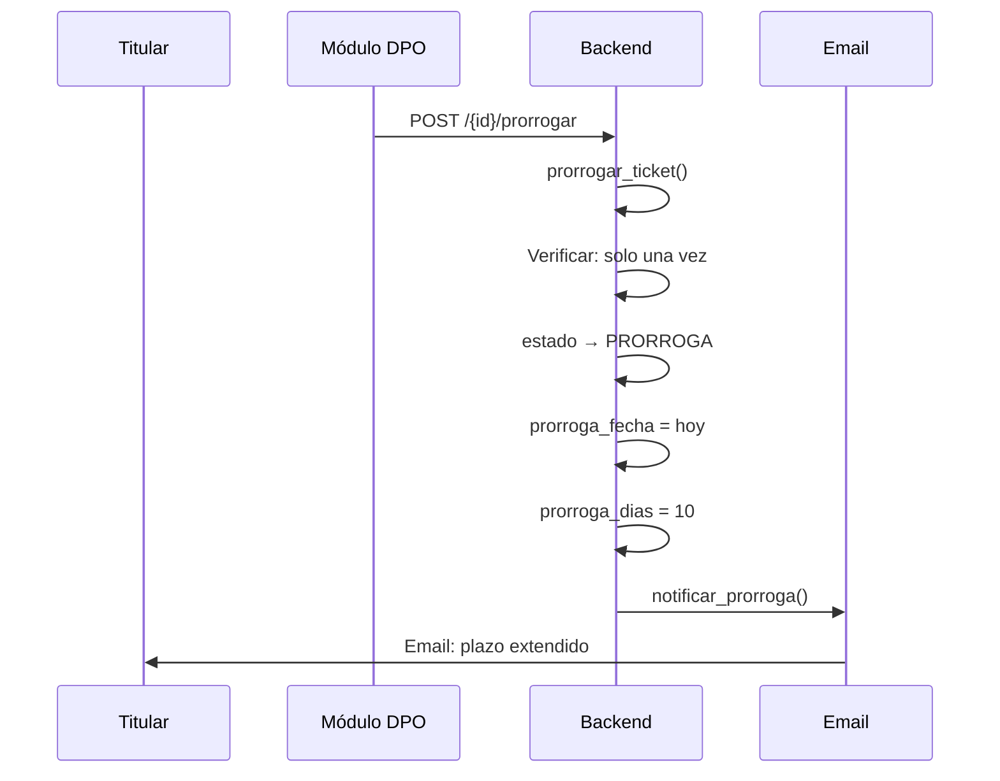

# Flujos ARCO — Custodio RAT

> **⚠️ NOTA DE ACTUALIZACIÓN (2026-08-09):** La sección 3 ("Vista del titular — Formulario público `/solicitud_derecho`") describe una funcionalidad **eliminada en julio 2026**. El formulario público ARCO ya no existe. Los flujos de creación de solicitudes son exclusivamente internos (staff autenticado via `/tkt-solicitud-derecho/`). El titular puede consultar el estado de su solicitud en `/seguimiento/{tracking_token}` sin autenticación. La tabla canónica es `tkt_solicitud_derecho` (no `solicitudes_derecho`).

> Documentación visual de los flujos de derechos ARCO (Acceso, Rectificación, Cancelación, Oposición, Bloqueo, Portabilidad) implementados en Custodio RAT, conforme a la Ley 21.719.

## Tabla de contenidos

1. [Resumen ejecutivo](#1-resumen-ejecutivo)
2. [Diagrama general de estados](#2-diagrama-general-de-estados)
3. [Vista del titular](#3-vista-del-titular)
4. [Vista del DPO](#4-vista-del-dpo)
5. [Flujo por tipo ARCO](#5-flujo-por-tipo-arco)
6. [Workflow transversal](#6-workflow-transversal)
7. [Matriz estado × acción](#7-matriz-estado--acción)
8. [API reference](#8-api-reference)
9. [Glosario legal](#9-glosario-legal)

---

## 1. Resumen ejecutivo

### ¿Qué son los derechos ARCO?

Los derechos ARCO son mecanismos legales que la Ley 21.719 (Ley de Protección de Datos Personales de Chile) otorga a los titulares de datos personales para ejercer control sobre sus datos en poder de entidades responsables.

| Sigla | Derecho | Fundamento legal |
|-------|---------|-------------------|
| **A** | Acceso | Art. 8 literal (a) |
| **R** | Rectificación | Art. 9 |
| **C** | Cancelación | Art. 8 literal (c) |
| **O** | Oposición | Art. 13 |
| **B** | Bloqueo | Art. 8 ter |
| **P** | Portabilidad | Art. 12 |

### Tipos de solicitudes en Custodio

 Custodio modela cada derecho ARCO como un ticket (`TktSolicitudDerecho`) con un ciclo de vida propio. La entidad 转 responsible del tratamiento (empresa) recibe y gestiona las solicitudes a través del módulo DPO.

```
Titular (formulario público)
    │
    ▼
┌─────────────────────────┐
│  TktSolicitudDerecho    │  ◄── Tracking token único (UUID)
│  ─────────────────────  │      Notificación al correo del titular
│  tipo: enum (6 valores)  │      Acuse de recibo automático
│  estado: enum (8 valores)│
│  empresa_id              │
└────────┬────────────────┘
         │ ←icket_service.py
         ▼
    Módulo DPO (app/tkt_solicitud_derecho)
         │
         ├── Resolver
         ├── Subsanar
         ├── Prorrogar
         ├── Rechazar (con fundado)
         ├── Bloquear / Desbloquear
         └── Exportar
```

### Plazos legales

| Derecho | Plazo máximo | Ampliable |
|---------|-------------|-----------|
| Acceso | 10 días hábiles | Sí (prórroga máx. 10 días) |
| Rectificación | 10 días hábiles | Sí (prórroga máx. 10 días) |
| Cancelación | 10 días hábiles | Sí (prórroga máx. 10 días) |
| Oposición | 10 días hábiles | Sí (prórroga máx. 10 días) |
| Bloqueo | Inmediato (Art. 8 ter) | — |
| Portabilidad | 10 días hábiles | Sí (prórroga máx. 10 días) |

---

## 2. Diagrama general de estados



### Detalle de estados

| Estado | Color en UI | Significado |
|--------|------------|-------------|
| `abierto` | 🔵 Azul | Solicitud nueva, sin atención |
| `en_proceso` | 🟡 Amarillo | DPO gestionando activamente |
| `pendiente` | 🟠 Naranja | Esperando respuesta del titular |
| `subsanacion` | 🟣 Morado | Titular debe subsanar documentación |
| `prorroga` | ⏳ Gris | Plazo extendido (Art. 12 bis) |
| `bloqueado` | 🔴 Rojo | Datos bloqueados (Art. 8 ter) |
| `resuelto` | ✅ Verde | Cierre favorable |
| `rechazado` | ❌ Rojo oscuro | Cierre con rechazo fundado |

---

## 3. Vista del titular

### 3.1 Formulario público — `/solicitud_derecho`

El formulario es accesible sin autenticación. Es la puerta de entrada a todo el sistema ARCO.

#### Pantalla inicial — Selección del derecho

```
┌──────────────────────────────────────────────┐
│  Custodio — Ejercicio de derechos ARCO       │
│                                              │
│  ¿Qué derecho desea ejercer?                │
│                                              │
│  ┌────────────────────────────────────────┐  │
│  │ 🟢 ACCESO                               │  │
│  │ Conocer qué datos personales           │  │
│  │ tenemos sobre usted                     │  │
│  └────────────────────────────────────────┘  │
│  ┌────────────────────────────────────────┐  │
│  │ 🔵 RECTIFICACIÓN                        │  │
│  │ Corregir datos inexactos o             │  │
│  │ incompletos                             │  │
│  └────────────────────────────────────────┘  │
│  ┌────────────────────────────────────────┐  │
│  │ 🔴 CANCELACIÓN                          │  │
│  │ Eliminar sus datos personales           │  │
│  │ de nuestros registros                   │  │
│  └────────────────────────────────────────┘  │
│  ┌────────────────────────────────────────┐  │
│  │ 🟠 OPOSICIÓN                             │  │
│  │ Oponerse al tratamiento de              │  │
│  │ sus datos                                │  │
│  └────────────────────────────────────────┘  │
│  ┌────────────────────────────────────────┐  │
│  │ 🟣 BLOQUEO                               │  │
│  │ Bloquear el tratamiento de              │  │
│  │ sus datos (Art. 8 ter)                  │  │
│  └────────────────────────────────────────┘  │
│  ┌────────────────────────────────────────┐  │
│  │ 🔷 PORTABILIDAD                          │  │
│  │ Recibir sus datos en formato            │  │
│  │ estructurado                            │  │
│  └────────────────────────────────────────┘  │
└──────────────────────────────────────────────┘
```

#### Campos del formulario (según tipo seleccionado)

**Comunes a todos los tipos:**

| Campo | Tipo | Validación | Requerido |
|-------|------|------------|-----------|
| Nombre completo | texto | min 2 chars | ✅ |
| RUN / Pasaporte | texto | formato chileno o pasaporte | ✅ |
| Email | email | formato válido | ✅ |
| Teléfono | texto | +56 9 XXXX XXXX | ✅ |
| Empresa | select | lista de empresas activas | ✅ |
| Tipo de solicitud | select | 6 opciones | ✅ |
| Descripción / Justificación | textarea | min 10 chars, máx 2000 | ✅ |

**Campos específicos — Representante (QW10):**

| Campo | Mostrar cuando | Validación |
|-------|----------------|------------|
| 「Actúo como representante」 toggle | siempre visible | booleano |
| Nombre del representante | toggle ON | min 2 chars |
| RUT del representante | toggle ON | formato chileno |

El toggle de representante fue implementado en **QW10**. Al activarlo, se expanden los campos de representante y se guardan en las columnas `representante_nombre` y `representante_rut` del modelo `TktSolicitudDerecho`.

**Adjuntos (QW10 — máx 5 archivos, 5 MB c/u):**

| Campo | Tipo | Validación |
|-------|------|------------|
| Archivos adjuntos | file input (multiple) | PDF, JPEG, PNG, GIF |

El formulario acepta hasta 5 archivos con las siguientes restricciones:
- Formatos permitidos: `application/pdf`, `image/jpeg`, `image/png`, `image/gif`
- Tamaño máximo por archivo: 5 MB
- Tamaño total máximo: 5 MB (validación en frontend)
- Los archivos se almacenan en `uploads/` del backend

#### Validaciones en tiempo real

- RUN chileno: dígito verificador válido
- Email: formato estándar
- Teléfono: prefijo +56, 9 dígitos
- Archivos: tipo MIME y tamaño antes de subir

#### Mensaje de error por tipo

| Error | Mensaje mostrado |
|-------|-----------------|
| RUN inválido | "El RUN ingresado no es válido" |
| Empresa no encontrada | "La empresa seleccionada no existe" |
| Archivos sobre 5 MB | "El archivo excede el tamaño máximo de 5 MB" |
| Formato inválido | "Solo se permiten archivos PDF, JPEG, PNG o GIF" |
| Campos faltantes | "Por favor complete todos los campos requeridos" |

### 3.2 Pantalla de éxito

Tras el envío exitoso del formulario, se muestra la siguiente pantalla:

```
┌──────────────────────────────────────────────┐
│                                              │
│           ✅ Solicitud recibida              │
│                                              │
│  Su solicitud ha sido registrada             │
│  exitosamente.                               │
│                                              │
│  ─────────────────────────────────────────   │
│                                              │
│  Número de seguimiento:                       │
│  ┌──────────────────────────────────────┐    │
│  │ 🔗 a1b2c3d4-e5f6-7890-abcd-          │    │
│  │     ef1234567890                     │    │
│  │                              📋 Copiar │    │
│  └──────────────────────────────────────┘    │
│                                              │
│  Guarde este número para consultar           │
│  el estado de su solicitud.                  │
│                                              │
│  Se ha enviado un correo a su email           │
│  con los detalles de su solicitud.           │
│                                              │
│  ─────────────────────────────────────────   │
│                                              │
│  ¿Desea hacer otra solicitud?               │
│  ┌──────────────────────────────────────┐    │
│  │      Nueva solicitud                  │    │
│  └──────────────────────────────────────┘    │
│                                              │
│  ┌──────────────────────────────────────┐    │
│  │      Consultar estado                 │    │
│  └──────────────────────────────────────┘    │
│                                              │
└──────────────────────────────────────────────┘
```

**Elementos clave de la pantalla de éxito (QW10):**

- **Tracking token** generado como UUID v4 único (columna `tracking_token` en BD)
- **Botón "Copiar"** permite copiar el tracking token al portapapeles
- **Link en email** apunta a `/seguimiento/{tracking_token}` — implementado en QW8
- **Botón "Consultar estado"** lleva a `/seguimiento`

### 3.3 Portal de seguimiento — `/seguimiento`

Accesible públicamente con el tracking token.

#### Estados y visualización

| Estado | Color | Mensaje | Muestra |
|--------|-------|---------|---------|
| `abierto` | 🔵 Azul | "Su solicitud ha sido recibida y está pendiente de revisión" | Timeline: recibido |
| `en_proceso` | 🟡 Amarillo | "Estamos procesando su solicitud" | Timeline: recibido → en proceso |
| `pendiente` | 🟠 Naranja | "Necesitamos información adicional de su parte" | Timeline + mensaje de requerimiento |
| `subsanacion` | 🟣 Morado | "Se le ha solicitado documentación adicional" | Instrucciones de subsanación |
| `prorroga` | ⏳ Gris | "El plazo ha sido extendido" | Nueva fecha de resolución |
| `bloqueado` | 🔴 Rojo | "Sus datos han sido bloqueados" | Detalle del bloqueo |
| `resuelto` | ✅ Verde | "Su solicitud ha sido resuelta favorablemente" | Detalle de la resolución + archivos |
| `rechazado` | ❌ Rojo oscuro | "Su solicitud ha sido rechazada" | Fundamento del rechazo |

#### Timeline visual

```
Recibido        En proceso      Resuelto
    ●─────────────●─────────────●
   18 Jun         19 Jun         22 Jun
  10:30          14:20          09:15
```

---

## 4. Vista del DPO

### 4.1 Dashboard — `/tkt_solicitud_derecho`

El módulo DPO es accesible solo para usuarios con rol `superadmin` o `admin_empresa`. Presenta 10 tabs de filtrado y un dashboard con métricas en tiempo real.

#### Dashboard KPI Cards

```
┌──────────────┐ ┌──────────────┐ ┌──────────────┐ ┌──────────────┐
│   ABIERTOS   │ │ EN PROCESO   │ │  PENDIENTES  │ │ SUBSANACIÓN  │
│      12      │ │      8       │ │      5       │ │      3       │
│   ▲ 2 hoy    │ │   ▼ 1 hoy    │ │   ─ 0 hoy    │ │   ▲ 1 hoy    │
└──────────────┘ └──────────────┘ └──────────────┘ └──────────────┘
┌──────────────┐ ┌──────────────┐ ┌──────────────┐ ┌──────────────┐
│  PRÓRROGA    │ │  BLOQUEADOS  │ │  RESUELTOS   │ │  RECHAZADOS  │
│      2       │ │      1       │ │     45       │ │      7       │
│   ▼ 0 hoy    │ │   ─ 0 hoy    │ │   ▲ 3 hoy    │ │   ▲ 1 hoy    │
└──────────────┘ └──────────────┘ └──────────────┘ └──────────────┘
```

**Nueva métrica (QW1):** `rat_id` permite filtrar tickets por identificador RAT oficial. `plazo_bloqueo_vencimiento` muestra la fecha de término del bloqueo.

### 4.2 Tabs de filtrado

| Tab | Filtro aplicado | Estado UI |
|-----|----------------|-----------|
| **Todos** | Sin filtro | 82 tickets |
| **Abiertos** | `estado = abierto` | 12 tickets |
| **En Proceso** | `estado = en_proceso` | 8 tickets |
| **Pendientes** | `estado = pendiente` | 5 tickets |
| **Subsanación** | `estado = subsanacion` | 3 tickets |
| **Prórroga** | `estado = prorroga` | 2 tickets |
| **Bloqueados** | `estado = bloqueado` | 1 tickets |
| **Resueltos** | `estado = resuelto` | 45 tickets |
| **Rechazados** | `estado = rechazado` | 7 tickets |
| **Portabilidad** | `tipo = portabilidad` | 6 tickets |

### 4.3 Drawer de detalle

Al hacer clic en un ticket se abre el drawer lateral. Estructura de secciones:

#### Sección 1 — Identificación

```
ID Ticket: #1024
Tipo: ACCESO          Estado: 🟡 EN PROCESO
Empresa: Mi Banco SA
Prioridad: Alta       Creado: 18/06/2026 10:30
 rat_id: RAT-2026-00421
 plazos_bloqueo_vencimiento: —
```

#### Sección 2 — Datos del titular

```
Nombre: Juan Pérez
RUN: 12.345.678-9
Email: juan.perez@gmail.com
Teléfono: +56 9 1234 5678

■ Actúa como representante
  Nombre: María López
  RUT: 98.765.432-1
```

#### Sección 3 — Detalle de la solicitud

```
Descripción:
"Solicito acceso a todos mis datos personales
 almacenados en Mi Banco SA, incluyendo
 historial de transacciones y consultas
 realizadas en los últimos 5 años."
```

#### Sección 4 — Archivos adjuntos

```
📎 curricula_juan.pdf (320 KB)
📎 cedula_identidad.pdf (1.2 MB)
```

#### Sección 5 — Acciones disponibles

Los botones visibles dependen del estado actual (ver Matriz estado × acción):

```
┌─────────────────┐  ┌─────────────────┐
│   Asignarme     │  │   Asignarme     │
└─────────────────┘  └─────────────────┘
```

#### Sección 6 — Historial de cambios

```
● 18/06/2026 10:30 — Creado
  Sistema: Solicitud creada desde formulario público
● 18/06/2026 14:20 — Asignado
  Asignado a: cperez@empresa.com
● 19/06/2026 09:15 — Estado cambiado
  Estado: ABIERTO → EN_PROCESO
  Nota: DPO inicia revisión
```

El historial incluye el hashchain de M1 para trazabilidad inmutable.

#### Sección 7 — Tracking Token (QW1)

```
Tracking token: a1b2c3d4-e5f6-7890-abcd-ef1234567890
🔗 Copiar enlace
```

El tracking token está visible en la tabla principal y en el drawer para fácil acceso del DPO.

---

## 5. Flujo por tipo ARCO

### 5.1 ACCESO

**Fundamento legal:** Art. 8 literal (a) Ley 21.719
**SLA:** 10 días hábiles (ampliable a 20 con prórroga)
**Mínimo de datos a entregar:** Todos los datos personales del titular en posesión del responsable



**Datos específicos en el drawer:**

| Campo | Descripción |
|-------|-------------|
| Tipo de acceso solicitado | Consulta general / Historial de transacciones / Datos específicos |
| Período de búsqueda | Desde – Hasta |
| Formato de entrega | Digital / Physical |

**Resolución — Acceso:**
- Se deben entregar todos los datos personales del titular
- Historial de tratamientos realizados
- Terceros con quienes se han compartido los datos
- Fundamento legal de cada tratamiento

---

### 5.2 RECTIFICACIÓN

**Fundamento legal:** Art. 9 Ley 21.719
**SLA:** 10 días hábiles
**Condición:** Datos inexactos, incompletos u obsoletos



**Campos adicionales en el drawer:**

| Campo | Descripción |
|-------|-------------|
| Campo a rectificar | nombre / email / dirección / RUN / teléfono / otro |
| Dato actual | Valor registrado actualmente |
| Dato correcto | Valor que el titular indica como correcto |
| Justificación | Motivo de la rectificación |

**Comportamiento del sistema:**
- La rectificación se hace directamente en la tabla del modelo de datos对应的 entidad
- Se registra en el hashchain de M1
- El titular recibe notificación de la corrección aplicada

---

### 5.3 CANCELACIÓN

**Fundamento legal:** Art. 8 literal (c) Ley 21.719
**SLA:** 10 días hábiles
**Excepciones (Art. 8 literal c.ii):**

- Datos necesarios para el cumplimiento de una obligación legal
- Datos requeridos para la formulación, ejercicio y defensa de derechos legales
- Datos de personas naturales en procesos de mediación
- Datos necesarios para tareas纱 de interés público



**Drawer — Sección Cancelación:**

| Campo | Descripción |
|-------|-------------|
| Motivo de cancelación | Solicitud del titular / Finalización de contrato / Otro |
| Datos a cancelar | Lista de conjuntos de datos identificados |
| Datos con terceros | ¿Se han compartido estos datos? (Sí/No) |
| Excepción aplicable | Si aplica, Art. 8 c.ii correspondiente |

**Resolución — Cancelación:**
- Eliminación lógica o física de los datos
- Certificación al titular de la eliminación
- Notificación a terceros si corresponde

---

### 5.4 OPOSICIÓN

**Fundamento legal:** Art. 13 Ley 21.719
**SLA:** 10 días hábiles
**Causales de oposición:**
- Tratamientos basados en interés legítimo
- Tratamientos con fines de marketing directo
- Tratamientos para decisiones automatizadas



**Drawer — Sección Oposición:**

| Campo | Descripción |
|-------|-------------|
| Tratamiento al que se opone | Descripción del tratamiento |
| Base legal del tratamiento | interés legítimo / marketing / decisión automatizada |
| Justificación del titular | Motivo de la oposición |
| Decisión DPO | Fundamento de si prevalece o no el interés legítimo |

---

### 5.5 BLOQUEO

**Fundamento legal:** Art. 8 ter Ley 21.719
**SLA:** Inmediato una vez fundado
**Característica especial:** No tiene prazo de resolución — el bloqueo puede ser indefinido hasta que el titular solicite el desbloqueo o se resuelva la situación



**Drawer — Sección Bloqueo:**

| Campo | Descripción |
|-------|-------------|
| Causal del bloqueo | Art. 8 ter — titular solicita bloqueo |
| rat_id | Identificador RAT oficial (QW1) |
| plazo_bloqueo_vencimiento | Fecha de término del bloqueo (nullable) |
| tracking_token | Token para seguimiento público |
| acuse_enviado_at | Fecha de notificación al titular |

**Campos nuevos en TktSolicitudDerecho (QW1):**

| Campo | Tipo | Descripción |
|-------|------|-------------|
| `rat_id` | String(50) | Identificador RAT oficial de la solicitud |
| `plazo_bloqueo_vencimiento` | Date | Fecha de término del bloqueo |
| `portability_data` | JSONB | Datos estructurados para portabilidad |
| `tracking_token` | UUID | Token único para seguimiento público |
| `acuse_enviado_at` | DateTime | Cuándo se envió el acuse al titular |

**Acciones de workflow:**

| Acción | Endpoint | Efecto |
|--------|----------|--------|
| Bloquear | `POST /{id}/bloquear` | `estado → BLOQUEADO` |
| Desbloquear | `POST /{id}/desbloquear` | `estado → EN_PROCESO` |
| Rechazar | `POST /{id}/rechazar` | `estado → RECHAZADO` con fundamento |

---

### 5.6 PORTABILIDAD

**Fundamento legal:** Art. 12 Ley 21.719
**SLA:** 10 días hábiles
**Formato:** Estructurado, de uso común y lectura mecánica (JSON, CSV, XML)



**Drawer — Sección Portabilidad:**

| Campo | Descripción |
|-------|-------------|
| Formato solicitado | JSON / CSV / Excel / PDF |
| Datos a exportar | Lista de tablas/campos identificados |
| portability_data | JSONB con datos estructurados |

**Endpoints implementados (QW1):**

| Endpoint | Método | Descripción |
|----------|--------|-------------|
| `/{id}/guardar_portabilidad` | POST | Guarda `portability_data` en BD |
| `/{id}/export` | GET | Exporta en formato PDF/CSV/Excel |

**Exportación (QW6):**
- PDF: Reporte formateado con datos del titular y detalle de la solicitud
- CSV: Datos tabulares estructurados
- Excel: Libro con múltiples hojas (datos personales, tratamientos, terceros)

---

## 6. Workflow transversal

### 6.1 Subsanación (QW3)

**Trigger:** DPO determina que la solicitud o documentación está incompleta
**Plazo para el titular:** 10 días hábiles desde la notificación
**Endpoint:** `POST /{id}/subsanar`



**Campos agregados al modelo (QW3):**

| Campo | Tipo | Descripción |
|-------|------|-------------|
| `subsanacion_detalle` | Text | Detalle de lo que se debe subsanar |
| `subsanacion_fecha_pedido` | DateTime | Cuándo se solicitó la subsanación |

**Endpoints QW3:**

| Endpoint | Método | Efecto |
|----------|--------|--------|
| `/{id}/subsanar` | POST | `estado → SUBSANACION`, +10 días hábiles |
| `/{id}/completar-subsanacion` | POST | `estado → EN_PROCESO`, resetea plazo |

---

### 6.2 Prórroga (QW4)

**Fundamento:** Art. 12 bis Ley 21.719
**Condiciones:**
- Máx. 10 días hábiles adicionales
- Solo una vez por solicitud
- Notificar al titular antes del vencimiento del plazo original



**Campos agregados al modelo (QW4):**

| Campo | Tipo | Descripción |
|-------|------|-------------|
| `prorroga_fecha` | DateTime | Fecha en que se otorga la prórroga |
| `prorroga_dias` | Integer | Días adicionales (máx. 10) |

**Endpoint QW4:**

| Endpoint | Método | Validación |
|----------|--------|------------|
| `/{id}/prorrogar` | POST | Solo si `prorroga_fecha IS NULL` |

---

### 6.3 Rechazo fundado

**Requisito legal:** Todo rechazo debe estar fundado (Art. 15 Ley 21.719)
**Campo en BD:** `observaciones` (Text) — almacena el fundamento

```mermaid
flowchart LR
    A([DPO decide<br/>rechazar]) --> B{¿Fundamento<br/>legal?}
    B -->|No| C[No puede<br/>rechazar]
    B -->|Sí| D[Rechazar<br/>con fundamento]
    D --> E[Notificar al<br/>titular]
    E --> F[Tracking:<br/>/seguimiento/{token}]
```

**Endpoints de rechazo:**

| Endpoint | Método | Efecto |
|----------|--------|--------|
| `/{id}/rechazar` | POST | `estado → RECHAZADO`, guarda fundamento en `observaciones` |

---

### 6.4 Bloqueo / Desbloqueo (Art. 8 ter)

El bloqueo es una medida especial que immobiliza el tratamiento de datos mientras persista la causal.

```mermaid
flowchart LR
    A([Titular alega<br/>bloqueo necesario]) --> B{¿Causal<br/>Art. 8 ter?}
    B -->|No| C[RECHAZADO]
    B -->|Sí| D[¿Datos ya<br/>bloqueados?]
    D -->|No| E[BLOQUEADO]
    D -->|Sí| F{¿Subsiste<br/>causal?}
    F -->|Sí| E
    F -->|No| G[DESBLOQUEADO<br/>→ EN_PROCESO]
    E --> H[Tracking:<br/>/seguimiento/{token}]
```

---

## 7. Matriz estado × acción

Indica qué botones/acciones están visibles en el módulo DPO para cada combinación de estado y tipo de solicitud.

| Estado | Asignar | Resolver | Subsanar | Prorrogar | Rechazar | Bloquear | Desbloquear | Exportar |
|--------|---------|----------|----------|-----------|----------|----------|-------------|---------|
| `abierto` | ✅ | ❌ | ❌ | ❌ | ❌ | ❌ | ❌ | ❌ |
| `en_proceso` | ✅ | ✅ | ✅ | ✅ | ✅ | ✅ | ❌ | ✅ |
| `pendiente` | ✅ | ❌ | ❌ | ❌ | ✅ | ❌ | ❌ | ❌ |
| `subsanacion` | ✅ | ❌ | ❌ | ❌ | ✅ | ❌ | ❌ | ❌ |
| `prorroga` | ✅ | ✅ | ❌ | ❌ | ✅ | ❌ | ❌ | ✅ |
| `bloqueado` | ✅ | ❌ | ❌ | ❌ | ✅ | ❌ | ✅ | ❌ |
| `resuelto` | ❌ | ❌ | ❌ | ❌ | ❌ | ❌ | ❌ | ✅ |
| `rechazado` | ❌ | ❌ | ❌ | ❌ | ❌ | ❌ | ❌ | ✅ |

### Reglas de visibilidad

1. **Resolver** solo disponible en `en_proceso` y `prorroga`
2. **Subsanar** solo disponible en `en_proceso` (si documentación incompleta)
3. **Prorrogar** solo una vez por ticket (`prorroga_fecha IS NULL`)
4. **Bloquear** solo disponible en `en_proceso` (tipo=BLOQUEO)
5. **Desbloquear** solo disponible en `bloqueado`
6. **Rechazar** disponible en todos los estados excepto `resuelto`
7. **Exportar** disponible en `resuelto`, `rechazado`, `en_proceso`, `prorroga`, `abierto`

---

## 8. API reference

### Endpoints públicos (sin autenticación)

| Método | Endpoint | Descripción |
|--------|----------|-------------|
| POST | `/solicitud_derecho` | Crear solicitud desde formulario público |
| GET | `/seguimiento/{tracking_token}` | Consultar estado público QW8 |

### Endpoints DPO (requiere auth + rol superadmin/admin_empresa)

| Método | Endpoint | Descripción | QW |
|--------|----------|-------------|-----|
| GET | `/tkt_solicitud_derecho` | Listar tickets (filtros por estado/tipo/empresa) | QW1 |
| GET | `/tkt_solicitud_derecho/{id}` | Detalle de ticket | QW1 |
| PATCH | `/tkt_solicitud_derecho/{id}` | Actualizar ticket (asignación, estado, plantilla) | QW1 |
| POST | `/tkt_solicitud_derecho/{id}/bloquear` | Bloquear ticket (Art. 8 ter) | QW1 |
| POST | `/tkt_solicitud_derecho/{id}/desbloquear` | Desbloquear ticket | QW1 |
| POST | `/tkt_solicitud_derecho/{id}/rechazar` | Rechazar con fundamento | QW1 |
| POST | `/tkt_solicitud_derecho/{id}/prorrogar` | Prorrogar plazo (Art. 12 bis) | QW4 |
| POST | `/tkt_solicitud_derecho/{id}/subsanar` | Solicitar subsanación | QW3 |
| POST | `/tkt_solicitud_derecho/{id}/completar-subsanacion` | Completar subsanación | QW3 |
| POST | `/tkt_solicitud_derecho/{id}/guardar_portabilidad` | Guardar datos de portabilidad | QW1 |
| GET | `/tkt_solicitud_derecho/{id}/export` | Exportar (PDF/CSV/Excel) | QW1 |
| POST | `/tkt_solicitud_derecho/{id}/notificar_acuse` | Reenviar acuse de recibo | QW2 |
| GET | `/tkt-plantillas` | Listar plantillas de respuesta | QW6 |
| POST | `/tkt-plantillas` | Crear plantilla | QW6 |
| GET | `/tkt-plantillas/{id}` | Obtener plantilla | QW6 |
| PUT | `/tkt-plantillas/{id}` | Actualizar plantilla | QW6 |
| DELETE | `/tkt-plantillas/{id}` | Eliminar plantilla | QW6 |
| GET | `/tkt-reglas-asignacion` | Listar reglas de auto-asignación | QW9 |
| POST | `/tkt-reglas-asignacion` | Crear regla | QW9 |
| GET | `/tkt-reglas-asignacion/{id}` | Obtener regla | QW9 |
| PUT | `/tkt-reglas-asignacion/{id}` | Actualizar regla | QW9 |
| DELETE | `/tkt-reglas-asignacion/{id}` | Eliminar regla | QW9 |

---

## 9. Glosario legal

| Término | Definición | Referencia |
|---------|-----------|------------|
| **ARCO** | Sigla para designar colectivamente los derechos de Acceso, Rectificación, Cancelación y Oposición, a los que se añaden Bloqueo y Portabilidad en el contexto chileno | Ley 21.719 |
| **Art. 8 ter** | Artículo que establece el derecho al bloqueo del tratamiento de datos personales | Ley 21.719, Art. 8 ter |
| **Art. 12 bis** | Artículo que establece la posibilidad de prorrogar el plazo de atención de solicitudes hasta por 10 días hábiles adicionales | Ley 21.719, Art. 12 bis |
| **Titular** | Persona natural cuyos datos personales son objeto de tratamiento | Ley 21.719, Art. 2 literal ñ |
| **Responsable del tratamiento** | Persona natural o jurídica que decide sobre el tratamiento de datos personales (empresa) | Ley 21.719, Art. 2 literal o |
| **DPO** | Data Protection Officer — persona encargada de la protección de datos personales en la empresa | Ley 21.719, Art. 22 |
| **RAT** | Registro de Atención de Titulares — identificador oficial de la solicitud ante la autoridad | Ley 21.719, Art. 14 |
| **Portabilidad** | Derecho del titular a recibir sus datos en formato estructurado y de uso común | Ley 21.719, Art. 12 |
| **Subsanación** | Acción de completar o corregir una solicitud que fue recibida de forma incompleta o defectuosa | Ley 21.719, Art. 11 |
| **Fundamento de rechazo** | Explicación legal que sustenta la decisión de rechazar una solicitud ARCO | Ley 21.719, Art. 15 |
| **Hashchain (M1)** | Cadena de hashes que garantiza la inmutabilidad de la bitácora de cambios en los tickets | Implementación QW1 |
| **Tracking token** | Identificador único (UUID) que permite a un titular seguir el estado de su solicitud públicamente | Implementación QW1/QW2 |
| **Prórroga** | Extensión del plazo legal de atención de una solicitud ARCO | Ley 21.719, Art. 12 bis |
| **Bloqueo** | Medida provisional que immobiliza el tratamiento de datos mientras se resuelve una solicitud | Ley 21.719, Art. 8 ter |
| ** CPDP** | Consejo de Protección de Datos Personales — órgano asesor en la ley chilena | Ley 21.719 |

---

## Historial de cambios del documento

| Fecha | Versión | Cambio |
|-------|---------|--------|
| 2026-06-18 | 1.0 | Creación inicial — basada en plan de implementación QW1-QW10 + M1+M2+M3+M5+E5 |
